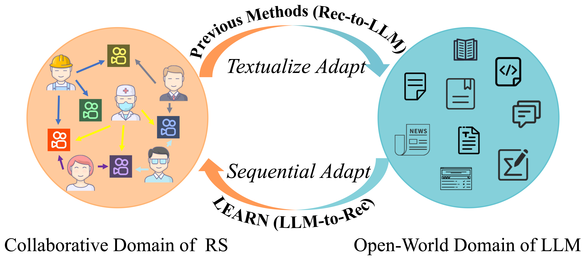

## LEARN: Knowledge Adaptation from Large Language Model to Recommendation for Practical Industrial Application


This repository contains the official implement of [LEARN](https://arxiv.org/abs/2405.03988) accepted to AAAI2025.
<p align="center">
    <br>
    
    <br>
<p>
<br>

### Dependencies
All experiments are conducted on python 3.10.14 and cuda-version==12.5 with 4x A100(80G) GPUs.

Core packages are shown below :
```
lmdb=1.4.1
numpy=1.26.4
torch=2.3.1
tqdm=4.66.4
transformers=4.46.0.dev0
wandb=0.18.6
```

### Data Preparation

To make a fair comparison, we use the same data as [Recformer](https://github.com/AaronHeee/RecFormer?tab=readme-ov-file). 
The [pretrain data](https://drive.google.com/file/d/123AHjsvZFTeT_Mhfb81eMHvnE8fbsFi3/view) and [finetuning data](https://drive.usercontent.google.com/download?id=11wTD3jMoP_Fb5SlHfKr28NIMCnG_jOpy&export=download&authuser=0) are provided in Google Drive.

1. Download the data and put them in the data folder.
2. Run the following command to generate the train_product/val_product/test_product files.
```
python preprocess/amazon_2018/motify_json.py
```
3. Run the following command to generate the text description of items.
```
python preprocess/amazon_2018/build_product2text.py
```
4. Run the following command to generate the item embeddings and build the lmdb file to achieve fast indexing.
```
python preprocess/amazon_2018/extract_baichuan_emb_pretrain.py
python preprocess/amazon_2018/build_item_baichuan_lmdb_pretrain.py
python preprocess/amazon_2018/extract_baichuan_emb_ft.py
python preprocess/amazon_2018/build_item_baichuan_lmdb_ft.py
```
5. Prepare datasets to have following structure. The item embedding files can be downloaded from [here](https://drive.google.com/file/d/11wTD3jMoP_Fb5SlHfKr28NIMCnG_jOpy/view?usp=sharing).

```
amazon_2018
├── pretrain_data
│   ├── train.json
│   ├── smap.json
│   ├── meta_data.json
│   ├── dev.json 
│   ├── product2text.dict
│   └── productid2idx.pkl
├── finetune_data (take Arts as an example)
│   ├── Arts
│   │   ├── meta_data.json 
│   │   ├── product2text.dict
│   │   ├── smap.json
│   │   ├── umap.json
│   │   ├── train.json
│   │   ├── train_product.json
│   │   ├── val.json
│   │   ├── val_product.json
│   │   ├── test.json
│   │   └ test_product.json
│   ├── Arts_baichuan_lmdb
│   └── product2emb_Arts.pkl
└── item_embeddings
    ├── item_baichuan_lmdb
    ├── pretrain.txt
    ├── Arts.txt
    ├── Instruments.txt
    ├── Office.txt
    ├── Scientific.txt 
    ├── Pet.txt
    └── Games.txt
```


## Pretrain Stage

To pretrain LEARN on Amazon Reviews, you can run the following command.
```
bash run_pretrain.sh
```


## Finetuning stage
For downstream datasets (Arts, Office, Scientific, Instruments, Pet, Games), you can run the following command and just change the "dataset" parameter. 
```
bash run_finetune.sh
```


## Performance

The following LERAN results can be reproduced by our code.
The other results can be found in the corresponding paper [RecFormer](https://dl.acm.org/doi/abs/10.1145/3580305.3599519)(KDD 2023), [SAID](https://dl.acm.org/doi/abs/10.1145/3589335.3648307)(WWW 2024), [CALRec](https://dl.acm.org/doi/abs/10.1145/3640457.3688121)(RecSys 2024).
The [checkpoints](https://drive.google.com/drive/folders/12QXyYftF0r06ie2j9kc6XPbOpgA78dQN?usp=drive_link) are also provided.


| Dataset | Metric | GRU4Rec | SASRec | BERT4Rec | RecGURU | FDSA | S³-Rec | ZESRec | UniSRec | RecFormer | SAID       | CALRec | LEARN | 
|---------|--------|---------|--------|----------|---------|------|--------|--------|---------|-----------|------------|--------|-------|
| Scientific | NDCG@10 | 0.0826 | 0.0797 | 0.0790 | 0.0575 | 0.0716 | 0.0451 | 0.0843 | 0.0862 | 0.1027    | 0.1050     | 0.0788 | **0.1060** |
| | Recall@10 | 0.1055 | 0.1305 | 0.1061 | 0.0781 | 0.0967 | 0.0804 | 0.1260 | 0.1255 | 0.1448    | 0.1353     | 0.1124 | **0.1594** |
| Instruments | NDCG@10 | 0.0633 | 0.0634 | 0.0707 | 0.0468 | 0.0731 | 0.0797 | 0.0694 | 0.0785 | 0.0830    | **0.0928** | 0.0909 | 0.0878 |
| | Recall@10 | 0.0969 | 0.0995 | 0.0972 | 0.0617 | 0.1006 | 0.1110 | 0.1078 | 0.1119 | 0.1052    | 0.1211     | 0.1158 | **0.1240** |
| Arts | NDCG@10 | 0.1075 | 0.0848 | 0.0942 | 0.0525 | 0.0994 | 0.1026 | 0.0970 | 0.0894 | 0.1252    | 0.0864     | 0.1090 | **0.1225** |
| | Recall@10 | 0.1317 | 0.1342 | 0.1236 | 0.0742 | 0.1209 | 0.1399 | 0.1349 | 0.1333 | 0.1614    | 0.1487     | 0.1140 | **0.1701** |
| Office | NDCG@10 | 0.0761 | 0.0832 | 0.0972 | 0.0500 | 0.0922 | 0.0911 | 0.0865 | 0.0919 | 0.1141    | **0.1208** | 0.0967 | 0.1167 |
| | Recall@10 | 0.1053 | 0.1196 | 0.1205 | 0.0647 | 0.1285 | 0.1186 | 0.1199 | 0.1262 | 0.1403    | 0.1450     | 0.1213 | **0.1549** |
| Games | NDCG@10 | 0.0586 | 0.0547 | 0.0628 | 0.0386 | 0.0600 | 0.0532 | 0.0530 | 0.0580 | 0.0684    | **0.0812** | 0.0595 | 0.0798 |
| | Recall@10 | 0.0988 | 0.0953 | 0.1029 | 0.0479 | 0.0931 | 0.0879 | 0.0844 | 0.0923 | 0.1039    | 0.1204     | 0.0986 | **0.1345** |
| Pet | NDCG@10 | 0.0648 | 0.0569 | 0.0602 | 0.0366 | 0.0673 | 0.0742 | 0.0754 | 0.0702 | 0.0972    | 0.0951     | 0.0736 | **0.0990** |
| | Recall@10 | 0.0781 | 0.0881 | 0.0765 | 0.0415 | 0.0949 | 0.1039 | 0.1018 | 0.0933 | 0.1162    | 0.1129     | 0.0937 | **0.1284** |


## Acknowledgements
Codes are based on the repository from [Chinese-CLIP](https://github.com/OFA-Sys/Chinese-CLIP) and [RecFormer](https://github.com/AaronHeee/RecFormer). 
Thanks for their great work.


## Contact
If you have any questions, please raise an issue or contact us at [jian.jia@outlook.com](mailto:jian.jia@outlook.com).

## Citation
If our work has helped you in your work, please give us a star ⭐ or cite our work:
```
@article{jia2024knowledge,
  title={LEARN:Knowledge Adaptation from Large Language Model to Recommendation for Practical Industrial Application},
  author={Jia, Jian and Wang, Yipei and Li, Yan and Chen, Honggang and Bai, Xuehan and Liu, Zhaocheng and Liang, Jian and Chen, Quan and Li, Han and Jiang, Peng and others},
  journal={arXiv preprint arXiv:2405.03988},
  year={2024}
}
```